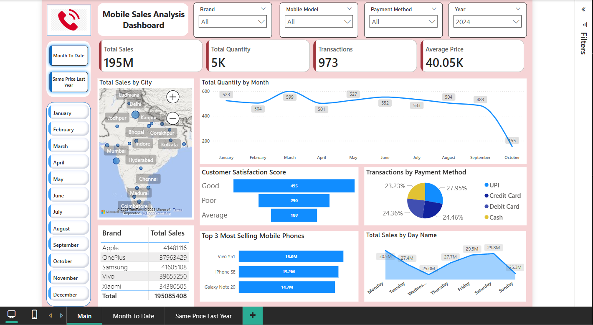
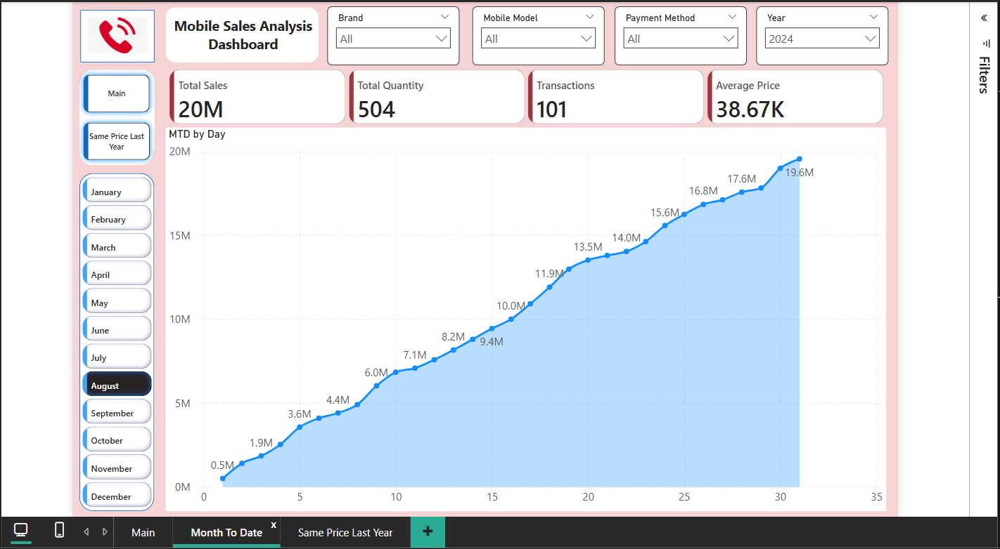
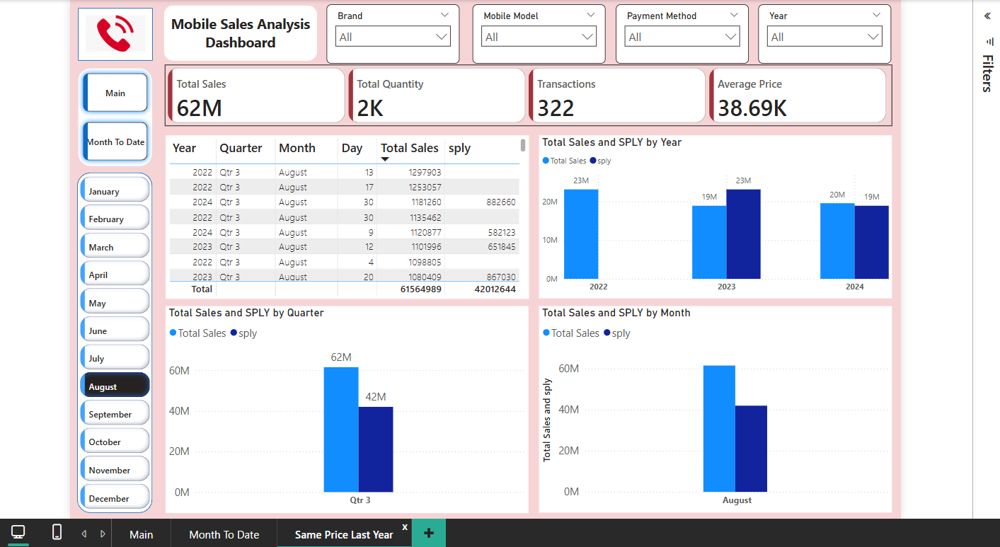

# 📊 Mobile Sales Analysis Dashboard

This Power BI project presents an interactive and insightful dashboard for analyzing mobile phone sales across cities in India. It helps track sales metrics, performance trends, and customer insights using modern data visualization techniques.

---

## 🚀 Key Business Impacts
| Metric | Value | Insight |
|---|---|---|
| **Total Sales** | ₹195M | Apple/Samsung dominate (68% share) |
| **Top Models** | Vivo Y51, iPhone SE | 32% of total revenue |
| **Customer Satisfaction** | 84% "Good" | Correlates with UPI purchases |
| **Peak Sales Period** | Q3 (Aug-Oct) | 38% higher than Q2 average |
| **Geo Coverage** | 28 cities | Mumbai/Delhi = 45% of sales |

---

### 🚀 Project Highlights
- 📍 Geo-mapped sales across Indian cities
- 📊 Brand/model-wise performance analysis
- 📈 Monthly & daily trend visualizations
- 🔄 Year-over-year growth comparisons
- 💳 Payment method breakdown (UPI, Card, Cash)
- 😊 Customer satisfaction scoring (Good, Avg, Poor)
- 📤 Built with Power BI & DAX measures

---

## 📌 Key Features

### ✅ Dashboard 1: Overall Sales Overview
- Total Sales: ₹195M
- Total Quantity Sold: 5K units
- Most Sales from: **Apple**, **Samsung**, and **Vivo**
- City-wise insights on a map of India
- Payment method breakdown (UPI, Credit, Debit, Cash)
- Top 3 best-selling models: **Vivo Y51**, **iPhone SE**, **Galaxy Note 20**
- Customer Satisfaction categories: Good, Average, Poor

### 📅 Dashboard 2: Month-To-Date (MTD) Analysis
- Daily sales growth over the current month
- Real-time MTD tracking for quantity, revenue, and transactions
- Useful for performance evaluation within an ongoing period

### 📊 Dashboard 3: Year-over-Year Comparison
- Compares **Total Sales vs SPLY (Same Period Last Year)**
- Breakdown by Year, Quarter, and Month
- Visual bar chart comparisons for quick evaluation

---

### 🛠️ Tools & Technologies Used

| Tool / Technology       | Purpose                                                                 |
|-------------------------|-------------------------------------------------------------------------|
| **Power BI Desktop**     | Primary tool for building the dashboard and visualizing data            |
| **DAX (Data Analysis Expressions)** | Creating calculated columns, measures, KPIs, and dynamic metrics |
| **Power Query Editor**  | Data transformation and preprocessing (cleaning, filtering, merging)    |
| **Excel / CSV Files**   | Used as data sources for mobile sales, transactions, and satisfaction   |
| **Map Visuals (Azure Maps / OpenStreetMap)** | For geographic representation of sales by city              |
| **Card Visuals**        | Showcasing key performance indicators like Total Sales, Quantity, etc.  |
| **Bar & Line Charts**   | Trend analysis over time (monthly, daily, quarterly)                    |
| **Pie Charts / Donut Charts** | Visual breakdown of transactions by payment methods              |
| **Matrix Table / Data Table** | Tabular display of multi-dimensional sales data                    |
| **Slicers (Brand, Model, Year, Month)** | Enable interactive filtering for dynamic insights              |
| **Bookmarks & Page Navigation** | Creating seamless tab-based views (Main, MTD, SPLY)               |
| **Conditional Formatting** | Highlighting important values or thresholds                           |

---

## 📷 Screenshots

### Main Sales Dashboard

### Month-To-Date Performance

### SPLY Comparison Dashboard

---

### 💬 Feedback / Contact

Have suggestions or want to use this project for business purposes?

📧 Email me at: katiyarsamyak4@gmail.com                
💼 [LinkedIn](https://www.linkedin.com/in/samyak-katiyar)
